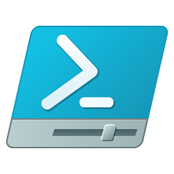

<h1>File Integrity Monitor</h1>

<h2>Description</h2>
This project involves creating a File Integrity Monitor (FIM) using hashing algorithms. FIM continuously checks file integrity by generating unique hashes from file contents. Any changes trigger alerts for immediate investigation. Through PowerShell or Python scripting, we'll build this system, providing practical cybersecurity experience in monitoring file integrity and detecting unauthorized modifications.
<h2>Languages and Utilities Used</h2>
- <b>PowerShell</b> 
<h2>Environments Used </h2>
- <b>Windows 10</b> 
<h2>Program walk-through:</h2>
<p align="center">
To get started, open PowerShell, a command-line shell developed by Microsoft. Within PowerShell, you'll run a script involving file operations. Remember to adjust the file paths in the script to match the locations of your files on your system. Once you've customized the paths, paste the script into the PowerShell window and execute it by pressing Enter. The script will then perform actions such as creating a baseline of file hashes and monitoring changes to those files based on the specified paths:<br/>


<br />
<br />
To obtain the hash value of a file using PowerShell, execute the following command: Get-FileHash -Path "C:\path\to\your\file.txt" -Algorithm SHA512. Replace "C:\path\to\your\file.txt" with the actual file path of the file you want to hash. Additionally, ensure that you specify the desired hash algorithm, in this case, SHA-512, by using the -Algorithm parameter."
 <br/>

<br />
<br />
Once you have finalized your code and ensured its correctness, the next step is to create a baseline file containing the hash values of the files you intend to monitor. To do this, open a text editor such as Notepad. Then, manually type or copy and paste the hash values corresponding to each file you wish to monitor into the text editor. Save the file with an appropriate name, such as "baseline.txt," ensuring that it is saved in the same directory as your PowerShell script for easy access. This baseline file will serve as a reference for detecting any changes in the monitored files during subsequent executions of your PowerShell script:<br/>


<br />
<br />
After ensuring that all files are located in the correct directories and have the appropriate paths, you can execute the script. When prompted, choose option 'B', and the monitoring process will commence: <br/>

<br />
<br />
Once you make alterations to the file being monitored and subsequently check PowerShell, you'll receive a detailed alert indicating that the file has been modified. This alert serves as a crucial notification, providing insights into any unauthorized or unexpected changes made to the file, ensuring the integrity and security of your system: <br/>

<br />
<br />
In conclusion, the File Integrity Monitor (FIM) project, implemented solely using PowerShell and leveraging the SHA-512 hashing algorithm, offers a robust solution for monitoring file integrity in a Windows environment. By generating hash values for specified files and comparing them against a baseline, users can detect any unauthorized modifications or tampering. This project provides a simple yet effective method to safeguard critical files against unauthorized changes, enhancing overall system security and integrity.
</p>

<!--
 ```diff
- text in red
+ text in green
! text in orange
# text in gray
@@ text in purple (and bold)@@
